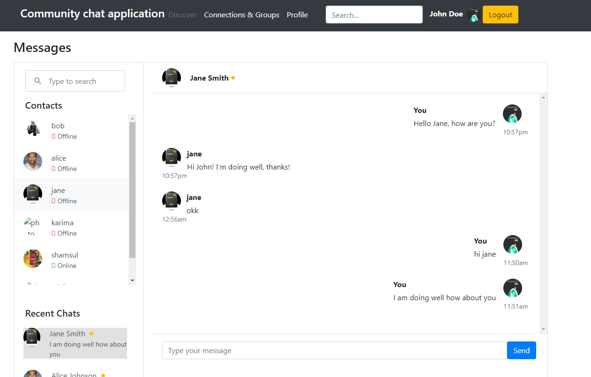
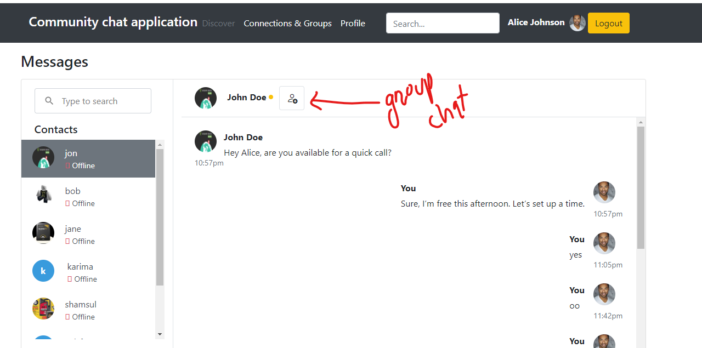
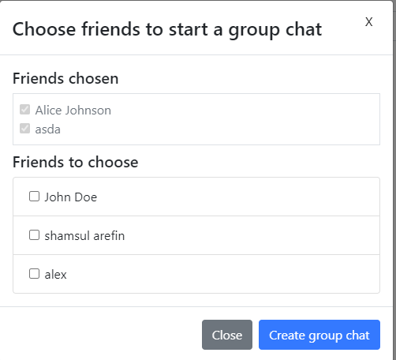
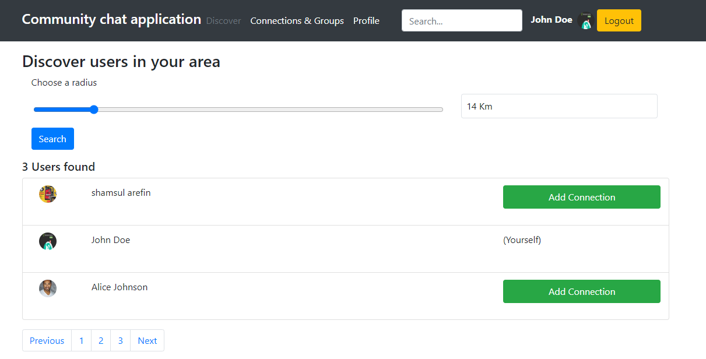

# Community Chat Application

## Overview

Welcome to the Community Chat Application! Our platform is designed to simplify connections and communication within a community, especially for newcomers. By using this app, you can easily find and interact with people and groups around you or in different areas, fostering meaningful relationships and engagement.

## Features

- **User Registration**: Sign up with your postal code to start connecting with others.
- **One-to-One Chat**: Initiate conversations with users in your area or elsewhere.
- **Group Chats**: Create and join group chats with friends or community members.
- **Search Functionality**: Explore people and groups by searching within a specified radius of your postal code or by name.
- **Add Requests**: Send requests to connect with individuals or join groups. Once your request is accepted, you can start chatting.
- **Group Creation**: Easily create and manage groups with your friends or other users.
- **Message Read/Unread Status**: Track whether your messages have been read or are still unread.

## How It Works

1. **Sign Up**: Register by entering your postal code to connect with local users.
2. **Search & Discover**: Use the search feature to find people or groups within your desired radius or by name. Adjust your search radius to explore different areas.
3. **Send Requests**: Send a request to connect with other users or to join group chats. Once your request is accepted, you can start chatting.
4. **Create Groups**: Form new groups with your friends or other users to facilitate more focused discussions and interactions.
5. **Chat & Connect**: Engage in conversations and build relationships with your community.

## Getting Started

1. **Register**: Create an account with your postal code.
2. **Explore**: Search for users and groups within your desired radius or by name.
3. **Connect**: Send add requests to start conversations or join groups.
4. **Create**: Set up new groups with friends or community members.
5. **Engage**: Start chatting and building your network.

Our goal is to make community interaction seamless and enjoyable, helping you to easily connect with others and establish new relationships.

Technology stack: Typescript, React, Vite, Redux, Redux Toolkit, Express, MongoDB, SocketIO

Installation:
- Clone the project.
- Have nodejs, and npm installed.
- Go to the backend and frontend folders in two terminals, and issue command `npm install`.
- in both terminals issue command `npm start`.

Features to be added:
* Content filtering, therefore users can report any message/user.

## Overview of the App

<h3>Home Page</h3>

### Create a group chat

### Group Chat room and searching friends

### Discovering users nearby and add as Friend

### Your friends, friend requests, groups

